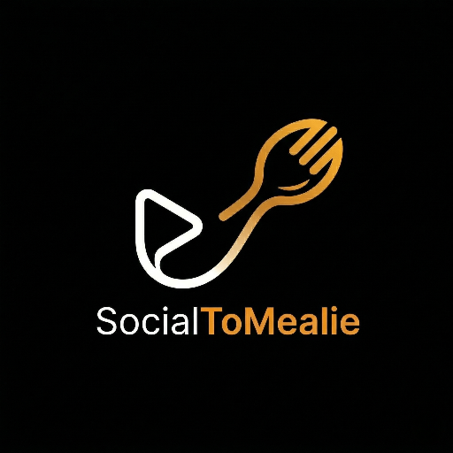

<p align="center">

</p>

# Social Media to Mealie

Have you found a recipe on social media and don’t want to write it out yourself? This tool lets you import recipes from
videos directly into [Mealie](https://github.com/mealie-recipes/mealie).

**Tested social media platforms:**

- Instagram
- TikTok
- Facebook
- YouTube Shorts
- Pinterest

Other sites may work as well, since the tool uses `yt-dlp` to download videos. If you encounter issues with other
websites, please open an issue.

> **Note:** If you receive a `BAD_RECIPE` error, it may be due to Mealie’s recipe parsing. If you find a better prompt
> or solution, feel free to open an issue or PR!

## Features

- Import posts into Mealie with a link and a click
- [iOS Shortcut v0.3](https://www.icloud.com/shortcuts/3778d926ed794dca95e658c6a4b5cf11) for easy importing
- PWA support, to allow sharing links to the app from mobile devices for quick importing.
- Telegram bot webhook support to import by chat message

## Screenshot


## Requirements

- [Mealie 1.9.0+](https://github.com/mealie-recipes/mealie) with AI provider
  configured ([docs](https://docs.mealie.io/documentation/getting-started/installation/open-ai/))
- [Docker](https://docs.docker.com/engine/install/)

## Deployment

<details open>
    <summary>Docker Compose</summary>

1. Create a `docker-compose.yml` file based on the [docker-compose.example.yml](https://github.com/GerardPolloRebozado/social-to-mealie/blob/main/docker-compose.example.yml)
   in the repo and fill in the required environment variables.
   If you prefer having them in a separate file you can create a `.env` file based on the [example.env](https://github.com/GerardPolloRebozado/social-to-mealie/blob/main/example.env).

2. **Start the service with Docker Compose:**

    ```sh
    docker-compose up -d
    ```

    </details>

<details>
    <summary>Docker Run</summary>

```sh
docker run --restart unless-stopped --name social-to-mealie \
  -e OPENAI_URL=https://api.openai.com/v1 \
  -e OPENAI_API_KEY=sk-... \
  -e TRANSCRIPTION_MODEL=whisper-1 \
  -e MEALIE_URL=https://mealie.example.com \
  -e MEALIE_API_KEY=ey... \
  -e MEALIE_GROUP_NAME=home \
  -p 4000:3000 \
  --security-opt no-new-privileges:true \
  ghcr.io/gerardpollorebozado/social-to-mealie:latest
```

</details>

<details>
    <summary>Local Development</summary>

1. Clone the repository and install dependencies:

    ```sh
    git clone https://github.com/GerardPolloRebozado/social-to-mealie.git
    cd social-to-mealie
    npm install
    ```

2. Create a `.env` file based on `example.env` and fill in your values:

    ```sh
    cp example.env .env
    ```

3. Create an empty `cookies.txt` file (required by the volume mount if defined in `docker-compose.yml`):

    ```sh
    touch cookies.txt
    ```

4. Build and start the container locally:

    ```sh
    docker compose build
    docker compose up -d
    ```

    The app will be available at `http://localhost:4000`.

5. To view logs:

    ```sh
    docker logs -f social-to-mealie
    ```

</details>

> [!TIP]
> In order to be able to install the PWA the app needs to have HTTPS, you can use a reverse proxy like caddy or nginx,
> but be careful as opening this app to the internet as it will allow anyone to submit recipes to your Mealie instance.
> I recommend adding a small log in or IP whitelist

## Environment Variables

| Variable                  | Required | Default                     | Description                                                                                                                            |
| ------------------------- | -------- | --------------------------- | -------------------------------------------------------------------------------------------------------------------------------------- |
| OPENAI_URL                | Yes      | `https://api.openai.com/v1` | URL for the OpenAI API or a compatible one                                                                                             |
| OPENAI_API_KEY            | Yes      | —                           | API key for OpenAI or a compatible one                                                                                                 |
| TRANSCRIPTION_MODEL       | No       | `whisper-1`                 | Whisper model to use, required when the local one is not filled                                                                        |
| LOCAL_TRANSCRIPTION_MODEL | No       | —                           | Model ID from hugging face to use for local audio to text transcription, required when the provider doesn't support transcriptions API |
| TEXT_MODEL                | Yes      | `gpt-5-mini`                | Text model to use for recipe generation                                                                                                |
| MEALIE_URL                | Yes      | `http://localhost:9000`     | URL of your Mealie instance                                                                                                            |
| MEALIE_API_KEY            | Yes      | —                           | API key for Mealie                                                                                                                     |
| MEALIE_GROUP_NAME         | No       | `home`                      | Mealie group name                                                                                                                      |
| EXTRA_PROMPT              | No       | —                           | Additional instructions for AI, such as language translation                                                                           |
| YTDLP_VERSION             | No       | `latest`                    | Version of yt-dlp to use                                                                                                               |
| PORT                      | No       | `4000`                      | Host port to expose the app on                                                                                                         |
| COOKIES                   | No       | —                           | Cookies string for yt-dlp to access protected content `NAME=VALUE`                                                                     |
| TELEGRAM_BOT_TOKEN        | No       | —                           | Telegram bot token from BotFather (required only for Telegram webhook imports)                                                         |
| TELEGRAM_WEBHOOK_SECRET   | No       | —                           | Secret token configured in Telegram webhook, validated via `x-telegram-bot-api-secret-token`                                           |
| TELEGRAM_ALLOWED_CHAT_IDS | No       | —                           | Comma-separated chat IDs allowed to use the bot. If empty, any chat can use it                                                         |
| TELEGRAM_DEFAULT_TAGS     | No       | —                           | Comma-separated Mealie tags automatically added to Telegram imports                                                                    |

## Telegram bot setup

1. Create a bot with BotFather and set `TELEGRAM_BOT_TOKEN`.
2. Set `TELEGRAM_WEBHOOK_SECRET` to a random string (recommended).
3. Configure your webhook URL in Telegram:

```sh
curl -X POST "https://api.telegram.org/bot<TELEGRAM_BOT_TOKEN>/setWebhook" \
  -H "Content-Type: application/json" \
  -d '{
    "url": "https://your-domain.example.com/api/telegram",
    "secret_token": "<TELEGRAM_WEBHOOK_SECRET>"
  }'
```

4. Send a social media link to your bot in Telegram. The bot will process the link and reply with the created Mealie recipe URL.

## Tested AI providers compatibility

- OpenAI
- GroqAI

## Partial support

Because theese providers don't support the transcriptions API it requires LOCAL_TRANSCRIPTION_MODEL to be set, recommended model: `Xenova/whisper-base`, you can use any model that is compatible with the ONNX runtime from hugging face

- llmstudio
- ollama

Some recommended models for local AI are:

- `qwen3-vl:8b`
- `gemma-3-12b`

If you want to use another model the model needs to have tools support and vision capabilities.
If you want better results use the same models but in larger variants.

It can work with any other provider that is compatible with the OpenAI API, if you find any issues please open an issue.

[](https://app.repohistory.com/star-history)
